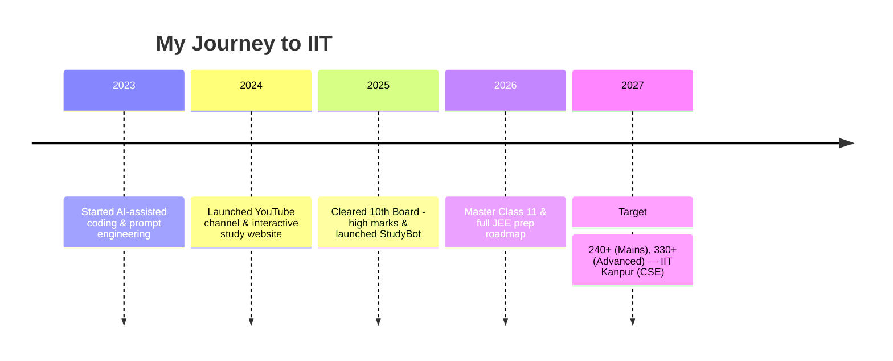

<p align="center">
	
</p>

<h1 align="center">Hi, I'm Deep Dey </h1>
<p align="center">
	<b>AI-Powered Learner | JEE Aspirant | Content Creator | Building Tomorrow, Today</b><br>
	
</p>
<br>

---

## 📌 Table of Contents
- [About Me](#about-me-🚀)
- [StudyBot — Project Overview](#studybot---project-overview)
- [Tech Stack](#️-tech-stack)
- [Pinned Projects](#pinned-projects-⭐)
- [Journey & Milestones](#journey--milestones-🏆)
- [Get Involved](#get-involved-🤝)
- [Contact & Socials](#contact--socials-🌐)

---

## About Me 🚀

Hello! I’m **Deep Dey**, a JEE aspirant and creator building StudyBot — a modular Discord assistant to help students study smarter and play lighter.

---

## StudyBot — Project Overview

StudyBot is a modular Discord bot that blends study tools (reminders, todos, announcements) with light social games and community features. It supports both prefix (`!`) and slash (`/`) commands and is designed to be extended via cogs.

Key features:
- Interactive Quiz with leaderboard & detailed feedback
- Reminders, Todos, Announcements, AFK system
- Games: Memory match, word scramble, math challenge, emoji quiz
- Ads/promotions, media handling, and admin tools

New Study-focused features (added):
- Pomodoro / Focus timer with DM notifications and session logging
- Daily study logs and weekly leaderboard
- Streak and productivity tracker
- Doubt collector for mentors and a `/motivate` AI-powered motivational reply (uses Gemini when configured)

---

## StudyBot — Features & Usage (detailed)

This section documents the study-first features in StudyBot, how to use them from Discord, and how they connect to the website and AI services.

1) Pomodoro Focus Timer
- What: Start a focused study session (default 25 min) and get notified when time's up.
- Why: Encourages focused study with short sprints and breaks.
- How (Discord): `/focus start 25` or `!focus start 25` — stop with `/focus stop`.
- Website: active sessions are exposed at `/api/active_focus` for dashboard display.

2) Daily Study Log System
- What: Log study time by subject/topic and view consolidated history.
- Why: Track study hours and generate weekly insights.
- How (Discord): `/log math 2h integration` or `!log subject:math time:2h topic:integration`.
- View: `/logs view` or `!logs view` to list recent logs.

3) Study Streak & Productivity Tracker
- What: Automatically tracks daily study streaks and highest streak.
- Why: Habit building and motivation via streaks.
- How (Discord): `/streak` or `!streak` shows current and highest streak.
- Storage: streaks are persisted in the SQLite DB (`streaks` table).

4) Reminder & Schedule Manager
- What: Schedule one-off or relative reminders that trigger in-channel or via DM.
- Why: Keeps users accountable for study sessions and events.
- How (Discord): `/remind 19:00 "Start Organic Chemistry"` or `!remind 10m Take a break`.
- Notes: Reminders are persisted and dispatched by a background scheduler.

5) Doubt Collector
- What: Submit study doubts/questions that create private threads for mentor review.
- Why: Organizes student questions and provides a private workflow for mentors.
- How (Discord): `/doubt How do I solve projectile motion?` or `!doubt <question>`.
- Admin: `!set_doubt_channel #channel` and `!set_mentor_role @Mentor` to configure.

6) Motivational AI Responder
- What: Sends motivational replies and context-sensitive encouragements.
- Why: Helps students stay motivated when they report low morale.
- How (Discord): `/motivate` or `/motivate I feel demotivated` — will use Gemini if configured, otherwise fall back to built-in prompts.

7) Study Partner Mode
- What: Simulates a study partner with periodic check-ins in a channel.
- Why: Provides social accountability and regular reminders during focus sessions.
- How (Discord): `/partner start 25` to start a partner session and `/partner stop` to end.

8) Leaderboard (Competitive Mode)
- What: Ranks students by logged study time (per-server leaderboard) and displays XP/levels.
- Why: Drives friendly competition and engagement.
- How (Discord): `/leaderboard`, `/rank` shows your level and XP.
- Website: leaderboard data can be pulled from `/api/leaderboard` for the dashboard.

9) Quote / Motivation of the Day
- What: Daily motivational quote posted automatically (configurable hour).
- Why: Keeps morale high and provides a small, positive nudge every day.
- How: Configured by `QUOTE_HOUR` (UTC) in environment or `config.json`.

10) Focus Room (Voice Channel Guard)
- What: Make a voice channel a distraction-free focus room; auto-mute new joiners.
- Why: Maintain silence and reduce interruptions during voice study sessions.
- How (Discord): `/focusroom start 30` (requires Manage/Mute permissions) and `/focusroom stop`.

11) Live Ping & Uptime Dashboard
- What: Small Flask site bundled with the bot exposes endpoints used by the website.
- Why: Show real-time bot status and active sessions on your site.
- Endpoints: `/api/active_focus`, `/stats`, `/api/leaderboard` (check `bot.py` for exact routes).

12) StudyBot Analytics Page
- What: Visualize users, total hours, streaks and subject breakdowns.
- Why: Helps server admins and students review progress over time.
- How: The site reads aggregated data from the bot's API endpoints and the DB.

13) AI Study Suggestion System
- What: Suggests next subject or topic to balance study time using simple heuristics or Gemini.
- Why: Helps students target weak subjects and balance preparation.
- How: The mentor cog analyzes study logs; improvements route through the AI Mentor when configured.

14) Progress Tracker (per-subject)
- What: Track subject-wise completion percentage (e.g. JEE progress tracker).
- How (Discord): `/progress update math 70` and `/progress view`.
- Website: shows progress bars per subject.

15) (Voice input control is an optional advanced feature)
- What: (MVP not included) Accept voice commands or short audio clips to control the bot (start timers, logs).
- Why: Hands-free interaction.
- Notes: This requires speech-to-text (Whisper/Cloud) and is marked as an enhancement.

16) Voice Command Mode (experimental)
- What & How: If implemented, the bot can parse short audio uploads or VC speech and map to commands like `start timer 30`.

17) AI Mentor Mode
- What: Generates personalized revision plans using Gemini (or mock fallback text).
- How (Discord): `/mentor plan chemistry 5` or `!mentor plan chemistry 5`.
- Notes: Requires `gemini_api_key` configured to use real model generation; otherwise the cog returns a helpful mock plan.

18) Reward & Level System
- What: Earn XP for study logs, streaks and focus sessions; unlock badges and titles.
- How: `/rank` shows XP, level, and badges. The DB stores achievements and wallets for future economy features.

19) (Custom reports and exports)
- What: Weekly exports or JSON snapshots can be added; currently, DB tables and endpoints make it straightforward to build exports.

20) AI Productivity Coach (weekly summaries)
- What: Weekly performance analysis and actionable feedback generated by Gemini or fallback templates.
- How: Implemented as a planned scheduled job — can be added to `cogs/` as `coach.py` to send summaries to users or channels.

Bonus visual features
- Animated favicon, active-users widget, rotating banners and a live quote ticker — the site includes placeholders and examples in `index.html`.

---

## How to use the most common study commands (examples)

- Start a focus session (Pomodoro):
	- `/focus start 25`  — starts a 25-minute session
	- `/focus stop` — stops and credits the session

- Log study time manually:
	- `/log math 2h integration` or `!log subject:math time:2h topic:integration`

- View today's/your recent logs:
	- `/logs view`

- Streaks & ranks:
	- `/streak` — your streak
	- `/rank` — your level, XP and streak

- Reminders & schedule:
	- `/remind 18:30 Start Organic Chemistry`
	- `!remind 10m Take a short break`

- Doubts:
	- `/doubt How do I approach projectile motion?`
	- Admins: `/set_doubt_channel #doubts` and `/set_mentor_role @Mentor`

- Study partner:
	- `/partner start 50` — starts a 50-minute co-study session in the channel

- Focus room (voice):
	- `/focusroom start 30` — lock voice channel into focus mode (auto-mutes new joiners)

- AI Mentor & Coach:
	- `/mentor plan chemistry 5` — generates a 5-day plan (Gemini if configured)

---

## Gemini / AI Notes
- To enable Gemini-based responses, add your API key to `config.json` or `.env` as `gemini_api_key`.
- The mentor cog (`cogs/mentor.py`) will use Gemini when available and fall back to a helpful mock plan otherwise.
- For production usage, be mindful of API quotas and set reasonable timeouts in your environment.

## Troubleshooting
- If slash commands don't appear: wait a few minutes; the bot syncs commands on startup. Use `python bot.py --sync` if available.
- If reminders or scheduled jobs don't run reliably: consider installing `APScheduler` and wiring it into the bot for robust scheduling.
- Database errors: ensure `aiosqlite` is installed and the `data/` folder is writable. The DB file is `data/studybot.db`.

## Contributing & Next steps
- Add new cogs in the `cogs/` folder and export `async def setup(bot)`.
- Suggested follow-ups:
	- Consolidate reminder persistence into the DB (migrate from JSON files).
	- Add the weekly AI productivity coach (a `coach.py` cog).
	- Add a safe PowerShell script to force-push with confirmation (I can prepare this for you).


### Quick Setup

1. Clone the repository:
```bash
git clone https://github.com/yourusername/studybot.git
cd studybot
```

2. Create and activate virtual environment:
```powershell
# Windows PowerShell
python -m venv .venv
.\.venv\Scripts\Activate.ps1

# Linux/macOS
python3 -m venv .venv
source .venv/bin/activate
```

3. Install dependencies:
```bash
pip install -r requirements.txt
```

4. Set up environment variables:
```bash
cp .env.example .env
# Edit .env with your Discord token and other settings
```

5. Run the bot:
```bash
python bot.py
```

### Deployment on Render

1. Fork/push this repository to your GitHub account

2. Create a new Web Service on Render:
   - Connect your GitHub repository
   - Select the Python runtime
   - Set the build command: `pip install -r requirements.txt`
   - Set the start command: `python bot.py`

3. Configure Environment Variables on Render:
   - Add all variables from `.env.example`
   - Set `DISCORD_TOKEN` (required)
   - Set other optional variables as needed

4. Deploy:
   - Render will automatically deploy when you push changes
   - Monitor the deployment logs for any issues
   - Bot should start automatically after successful deployment

---

## 🛠️ Tech Stack

**Core:**


**Tools & Hosting:**


---

## Pinned Projects ⭐

| Project | Description | Link |
|---------|-------------|------|
| 🎯 **deepdey** | Interactive learning resources & tools | https://github.com/deepdeyiitgn/deepdey |
| 🚀 **deydeep** | Personal experiments & AI utilities | https://github.com/deepdeyiitgn/deydeep |

---

## Journey & Milestones 🏆



---

## Visuals & Animations

<p align="center">
	
</p>

<p align="center">
	
</p>

---

## Get Involved 🤝

- Fork the repo and open a PR for new cogs or improvements.
- Add new quiz banks to `data/games_bank.json` for more diverse questions.
- Improve UI/UX for embeds and add sound effects in media-handling.

---

## Contact & Socials 🌐

<p align="center">
	<a href="https://www.deepdeyiitk.com"></a>
	<a href="mailto:thedeeparise@gmail.com"></a>
	<a href="https://www.instagram.com/deepdey.official/"></a>
	<a href="https://www.youtube.com/@deepdeyiit"></a>
</p>

---

<p align="center">
	<em>Made with ❤️, AI power, and relentless focus by <b>Deep Dey</b></em>
</p>

{: style="max-width:100%" }

StudyBot is a modular, extensible Discord bot focused on study workflows, light games, reminders and community features. It ships as a set of cogs so you can pick, modify, or extend features quickly.

---

## ✨ Key highlights

- Dual command style: prefix (default `!`) and modern slash (`/`) commands
- Extended Game System:
  - Interactive Quiz with detailed feedback and statistics
  - Truth/Dare with smart follow-up suggestions
  - Memory Match, Word Scramble, and Math Challenge
  - Rock Paper Scissors and Connect-4
  - Comprehensive leaderboard system
- Smart Ads System:
  - Alternating study tips and promotional content
  - Beautiful embed formatting
  - Configurable intervals and content
- Advanced Moderation:
  - Terminal verification for critical actions
  - Detailed audit logging
  - Permission-based command access
- Rich Announcements:
  - Scheduled and manual announcements
  - Custom formatting with embeds
  - Channel-specific settings
- Additional Features:
  - AFK system with notifications
  - Quotes and reminders
  - Todo list management
  - Media file handling

---

## 🔧 Quick status

Project root: `c:\Users\pujad\Downloads\Basic Maths PW\studybot`

Python: 3.10+ recommended (3.11+ suggested)

Dependencies (see `requirements.txt`):

```text
discord.py>=2.0
python-dotenv
aiohttp
# optional but recommended for persistence
aiosqlite

Optional (for scheduled jobs and reminders):
- APScheduler (recommended for more robust scheduling, though the bot ships with a lightweight dispatcher): `pip install APScheduler`

Database:
- The bot uses SQLite by default. The DB file is at `data/studybot.db` and is auto-created on first run.
```

Install (PowerShell):

```powershell
python -m venv .venv ; .\.venv\Scripts\Activate.ps1 ; pip install -r requirements.txt
```

Install (Bash):

```bash
python -m venv .venv && source .venv/bin/activate && pip install -r requirements.txt
```

---

## ⚙️ Environment (.env)

Create a `.env` file in the project root with the following keys:

```
DISCORD_TOKEN=your_bot_token_here
PREFIX=!
```

Additional optional environment variables:

```
API_TOKEN=your_api_token_here   # secures the /api/analytics endpoint for your website
QUOTE_HOUR=6                   # hour (UTC) to post daily quote (default 6)
```

Smoke test
---------

After starting the bot, run the smoke test script in PowerShell (set `API_TOKEN` first):

```powershell
$env:API_TOKEN = 'your_api_token_here'
.\scripts\smoke_test.ps1
```

This will call `/stats`, `/api/active_focus`, `/api/leaderboard`, and `/api/analytics` locally to verify the HTTP endpoints.

You can also set environment variables directly instead of using a `.env` file.

---

## ▶️ How to run (local)

PowerShell:

```powershell
# activate venv (Windows PowerShell)
.\.venv\Scripts\Activate.ps1
python bot.py
```

Bash / macOS / Linux:

```bash
source .venv/bin/activate
python bot.py
```

The bot will attempt to sync slash commands on startup. The first sync may take several minutes to appear in your Discord client.

---

## ℹ️ About the bot & author

- Bot name: StudyBot
- Purpose: study utilities, community tools, and lightweight social games
- Owner / Author: Deep Dey (Discord: @deepdey.official)
- YouTube: https://www.youtube.com/channel/UCrh1Mx5CTTbbkgW5O6iS2Tw/
- Website: https://www.deepdeyiitk.com
- Instagram: https://www.instagram.com/deepdey.official/

For support, reach out on the bot owner's Discord or the contact methods above.

---

## 📚 Full commands reference (short)

This project supports both prefix commands (default `!`) and slash commands. The following is a compact list — for examples see `command_examples.txt` in the repository root.

### AFK
- `!afk [reason]` — set AFK (prefix)
- `/afk [reason]` — set AFK (slash)
- `!afk remove` — remove AFK
- `/afk remove` — remove AFK

### Ads (admin)
- `!ads` — show ads settings
- `!ads setthreshold <count>` — set ad threshold
- `!ads settext <text>` — set ad text
- `!ads enable` — enable ads
- `!ads disable` — disable ads
- `/ads` — show ads settings

### Games
- `!truth` / `/truth` — random truth
- `!dare` / `/dare` — random dare
- `!quiz start` — start quiz in chat
- `/quiz` — start interactive quiz (slash)
- `!quiz leaderboard` — show leaderboard
- `!rps <choice>` / `/rps` — play rock-paper-scissors
- `!guess` / `/guess` — start guess-the-number

### Quotes & Misc
- `!quote add <text>` — add a quote
- `!quote list` — list quotes
- `!time` / `/time` — show server time
- `!date` / `/date` — show date
- `!weather <location>` / `/weather` — show weather (uses wttr.in)

### Todos & Reminders
- `!todo add <text>` / `/todo add` — add todo
- `!todo list` / `/todo list` — list todos
- `!todo done <id>` / `/todo done` — mark todo done
- `!remindme <time> <message>` / `/remindme` — set a reminder

### Media
- `!media upload <file>` — upload file to media folder
- `!media list` — list media files
- `!media send <filename>` — send file
- `!media sendrandom` — send random media

### Admin
- `!kick <member> [reason]` — kick a user
- `!ban <member> [reason]` — ban a user
- `!unban <identifier>` — unban

...and more. See `all_commands.txt` for a plain-text summary and `command_examples.txt` for usage examples.

---

## 🔎 Examples (quick)

Prefix examples:

```
!afk I'm studying for 2 hours
!ads setthreshold 2
!truth
!dare
!quiz start
!rps rock
!todo add Finish chapter 3
```

Slash examples: open your client, type `/quiz` and fill the form.

---

## 🛠️ Extending or creating your own bot from this project

This repo is intentionally modular. To create your own bot using these files:

1. Fork or copy this repository.
2. Update `bot.py` metadata and presence if desired.
3. Create a new cog: add a file to `cogs/` and implement `async def setup(bot)` that adds your cog.

Minimal cog example:

```python
from discord.ext import commands

class Hello(commands.Cog):
	def __init__(self, bot):
		self.bot = bot

	@commands.command()
	async def hello(self, ctx):
		await ctx.send('Hello!')

async def setup(bot):
	await bot.add_cog(Hello(bot))
```

If you want slash commands in a cog, use `discord.app_commands` and `interaction.response` patterns. Remember to `defer()` long operations.

To add persistent settings use `utils/db.py` (SQLite via aiosqlite). If you prefer another DB, adapt `utils/db.py` accordingly.

---

## 📁 Files & folders (what's inside)

This section explains the role of each top-level file and folder in the repository so you know where to look and what to edit.

- `bot.py` — the application entrypoint. Loads environment variables, sets up `commands.Bot`, loads cogs, and syncs slash commands in `setup_hook`.
- `requirements.txt` — Python dependencies for the project. Use `pip install -r requirements.txt`.
- `.env` — (not committed by default) holds `DISCORD_TOKEN`, `PREFIX`, and other private keys. Keep this secret.
- `README.md` — project documentation (this file).

### Music notes

- The music cog streams audio via `ffmpeg` and `yt-dlp`. Please install `ffmpeg` on the host machine and ensure it's in PATH.
- Dependencies: `yt-dlp`, `PyNaCl` (voice). These are added to `requirements.txt`.
- The music cog plays a pre-configured Spotify playlist by scraping the public playlist page and resolving tracks via YouTube searches. No Spotify API key is used.

Commands:
- `/join` — bot joins your voice channel and starts playing the default playlist.
- `/leave` — bot leaves the voice channel.
- `/restart` — owner-only: reload playlist cache and clear music caches.

- `cogs/` — folder with cog modules. Each file implements a feature group and registers with `async def setup(bot)`:
	- `admin.py` — administrative commands (kick, ban, unban, mute/unmute wrappers).
	- `ads.py` — ads manager: posts configurable ad messages after N bot responses.
	- `afk.py` — AFK system (prefix + slash) with nickname tagging and mention notifications.
	- `announcements.py` — scheduled and manual announcement utilities.
	- `autoreply.py` — configured auto-replies per-channel.
	- `games.py` — truth/dare, interactive quiz, rps, guess, and leaderboard logic.
	- `media.py` — upload/list/send media files stored under `media/`.
	- `misc.py` — small helpers like time/date/weather.
	- `quotes.py` — quote bank and scheduled quote posting.
	- `reminders.py` — timed reminders per-user.
	- `todo.py` — personal todo list commands.
	- `progress.py`, `extras.py` — small utility commands and progress tracking.

- `data/` — persistent JSON files used at runtime. Not the production DB but useful for development and small deployments. Example files:
	- `games_bank.json` — large banks for truths, dares and quiz questions.
	- `quotes.json` / `quotes.txt` — quote seeds.
	- `reminders.json`, `todos.json`, `studybot.db` — runtime state files.

- `media/` — user-uploaded media files that `media.py` can serve.

- `utils/` — helper modules:
	- `helper.py` — small helpers for JSON I/O and time parsing.
	- `db.py` — simple async DB wrapper (SQLite via aiosqlite) for key/value persistence.

---


## 🎨 Visuals, badges and tips

You can add a banner or badges to the top of this README. For example:


Place `media/readme-banner.png` in `media/` to show the header image above.

---

## ⚠️ Troubleshooting

- If slash commands are missing: wait several minutes after startup or re-sync by restarting the bot.
- If the bot cannot edit nicknames: ensure the bot has `Manage Nicknames` and its role is above the target user.
- If DB persistence doesn't seem to work: install `aiosqlite` and restart.
 - If reminders or scheduled jobs don't run reliably, consider installing `APScheduler` and wiring it into the bot for robust schedule handling.

---

## 📜 License & attribution

This project is provided as-is. Attribution to the original author (Deep Dey) is appreciated for public forks.

---

## 📝 Changelog (short)

- Oct 2025 — Added full command parity for slash and prefix, expanded game banks to 200+ items, improved AFK and quiz slash handling, and added ads tuning.

```

---

## 📤 How to upload this project to GitHub

Follow the steps below to create a new GitHub repository and push this project. Replace `<your-repo>` and `<your-username>` with your values.

PowerShell (Windows):

```powershell
git init
git add .
git commit -m "Initial commit - StudyBot"
git branch -M main
git remote add origin https://github.com/<your-username>/<your-repo>.git
git push -u origin main
```

Bash / macOS / Linux:

```bash
git init
git add .
git commit -m "Initial commit - StudyBot"
git branch -M main
git remote add origin https://github.com/<your-username>/<your-repo>.git
git push -u origin main
```

Tips:
- Add a `.gitignore` (if not present) that includes `.env` and `studybot.db`.
- Use GitHub Secrets to store `DISCORD_TOKEN` for CI or Actions-based deployments.

For more advanced deployment (Heroku, Docker, VPS), I can add example workflows or Dockerfiles on request.

---
<div align="center"> 
  
 [](https://github.com/deepdeyiitgn/deepdey-discord_bot/)
</div>

---
<div align="center"> 
  
  [](https://github.com/deepdeyiitgn)
</div>

---
<div align="center"> 
  
  [](https://deepdeyiitk.com/)
</div>

---
<div align="center"> 
  
<p align="center">
 
  
</p>
</div>


<p align="center">
  <em>Made with ❤️, AI power, and relentless focus by <b>Deep Dey</b></em>
</p>


<div align="center"> 
  
  [](https://deepdeyiitk.com/)
</div>

