<p align="center">
	
</p>

<h1 align="center">Hi, I'm Deep Dey </h1>
<p align="center">
	<b>AI-Powered Learner | JEE Aspirant | Content Creator | Building Tomorrow, Today</b><br>
	
</p>
<br>

---

## 📌 Table of Contents
- [About Me](#about-me-🚀)
- [StudyBot — Project Overview](#studybot---project-overview)
- [Tech Stack](#️-tech-stack)
- [Pinned Projects](#pinned-projects-⭐)
- [Journey & Milestones](#journey--milestones-🏆)
- [Get Involved](#get-involved-🤝)
- [Contact & Socials](#contact--socials-🌐)

---

## About Me 🚀

Hello! I’m **Deep Dey**, a JEE aspirant and creator building StudyBot — a modular Discord assistant to help students study smarter and play lighter.

---

## StudyBot — Project Overview

StudyBot is a modular Discord bot that blends study tools (reminders, todos, announcements) with light social games and community features. It supports both prefix (`!`) and slash (`/`) commands and is designed to be extended via cogs.

Key features:
- Interactive Quiz with leaderboard & detailed feedback
- Reminders, Todos, Announcements, AFK system
- Games: Memory match, word scramble, math challenge, emoji quiz
- Ads/promotions, media handling, and admin tools

Quick run:

```powershell
# activate venv (Windows PowerShell)
.\.venv\Scripts\Activate.ps1
python bot.py
```

---

## 🛠️ Tech Stack

**Core:**


**Tools & Hosting:**


---

## Pinned Projects ⭐

| Project | Description | Link |
|---------|-------------|------|
| 🎯 **deepdey** | Interactive learning resources & tools | https://github.com/deepdeyiitgn/deepdey |
| 🚀 **deydeep** | Personal experiments & AI utilities | https://github.com/deepdeyiitgn/deydeep |

---

## Journey & Milestones 🏆

```mermaid
timeline
		title My Journey to IIT
		2023 : Started AI-assisted coding & prompt engineering
		2024 : Launched YouTube channel & interactive study website
		2025 : Cleared 10th Board - high marks & launched StudyBot
		2026 : Master Class 11 & full JEE prep roadmap
		2027 : Target: 240+ (Mains), 330+ (Advanced) — IIT Kanpur (CSE)
```



---

## Visuals & Animations

<p align="center">
	
</p>

<p align="center">
	
</p>

---

## Get Involved 🤝

- Fork the repo and open a PR for new cogs or improvements.
- Add new quiz banks to `data/games_bank.json` for more diverse questions.
- Improve UI/UX for embeds and add sound effects in media-handling.

---

## Contact & Socials 🌐

<p align="center">
	<a href="https://www.deepdeyiitk.com"></a>
	<a href="mailto:thedeeparise@gmail.com"></a>
	<a href="https://www.instagram.com/deepdey.official/"></a>
	<a href="https://www.youtube.com/@deepdeyiit"></a>
</p>

---

<p align="center">
	<em>Made with ❤️, AI power, and relentless focus by <b>Deep Dey</b></em>
</p>

{: style="max-width:100%" }

StudyBot is a modular, extensible Discord bot focused on study workflows, light games, reminders and community features. It ships as a set of cogs so you can pick, modify, or extend features quickly.

---

## ✨ Key highlights

- Dual command style: prefix (default `!`) and modern slash (`/`) commands
- Extended Game System:
  - Interactive Quiz with detailed feedback and statistics
  - Truth/Dare with smart follow-up suggestions
  - Memory Match, Word Scramble, and Math Challenge
  - Rock Paper Scissors and Connect-4
  - Comprehensive leaderboard system
- Smart Ads System:
  - Alternating study tips and promotional content
  - Beautiful embed formatting
  - Configurable intervals and content
- Advanced Moderation:
  - Terminal verification for critical actions
  - Detailed audit logging
  - Permission-based command access
- Rich Announcements:
  - Scheduled and manual announcements
  - Custom formatting with embeds
  - Channel-specific settings
- Additional Features:
  - AFK system with notifications
  - Quotes and reminders
  - Todo list management
  - Media file handling

---

## 🔧 Quick status

Project root: `c:\Users\pujad\Downloads\Basic Maths PW\studybot`

Python: 3.10+ recommended (3.11+ suggested)

Dependencies (see `requirements.txt`):

```text
discord.py>=2.0
python-dotenv
aiohttp
# optional but recommended for persistence
aiosqlite
```

Install (PowerShell):

```powershell
python -m venv .venv ; .\.venv\Scripts\Activate.ps1 ; pip install -r requirements.txt
```

Install (Bash):

```bash
python -m venv .venv && source .venv/bin/activate && pip install -r requirements.txt
```

---

## ⚙️ Environment (.env)

Create a `.env` file in the project root with the following keys:

```
DISCORD_TOKEN=your_bot_token_here
PREFIX=!
```

You can also set environment variables directly instead of using a `.env` file.

---

## ▶️ How to run (local)

PowerShell:

```powershell
# activate venv (Windows PowerShell)
.\.venv\Scripts\Activate.ps1
python bot.py
```

Bash / macOS / Linux:

```bash
source .venv/bin/activate
python bot.py
```

The bot will attempt to sync slash commands on startup. The first sync may take several minutes to appear in your Discord client.

---

## ℹ️ About the bot & author

- Bot name: StudyBot
- Purpose: study utilities, community tools, and lightweight social games
- Owner / Author: Deep Dey (Discord: @deepdey.official)
- YouTube: https://www.youtube.com/channel/UCrh1Mx5CTTbbkgW5O6iS2Tw/
- Website: https://www.deepdeyiitk.com
- Instagram: https://www.instagram.com/deepdey.official/

For support, reach out on the bot owner's Discord or the contact methods above.

---

## 📚 Full commands reference (short)

This project supports both prefix commands (default `!`) and slash commands. The following is a compact list — for examples see `command_examples.txt` in the repository root.

### AFK
- `!afk [reason]` — set AFK (prefix)
- `/afk [reason]` — set AFK (slash)
- `!afk remove` — remove AFK
- `/afk remove` — remove AFK

### Ads (admin)
- `!ads` — show ads settings
- `!ads setthreshold <count>` — set ad threshold
- `!ads settext <text>` — set ad text
- `!ads enable` — enable ads
- `!ads disable` — disable ads
- `/ads` — show ads settings

### Games
- `!truth` / `/truth` — random truth
- `!dare` / `/dare` — random dare
- `!quiz start` — start quiz in chat
- `/quiz` — start interactive quiz (slash)
- `!quiz leaderboard` — show leaderboard
- `!rps <choice>` / `/rps` — play rock-paper-scissors
- `!guess` / `/guess` — start guess-the-number

### Quotes & Misc
- `!quote add <text>` — add a quote
- `!quote list` — list quotes
- `!time` / `/time` — show server time
- `!date` / `/date` — show date
- `!weather <location>` / `/weather` — show weather (uses wttr.in)

### Todos & Reminders
- `!todo add <text>` / `/todo add` — add todo
- `!todo list` / `/todo list` — list todos
- `!todo done <id>` / `/todo done` — mark todo done
- `!remindme <time> <message>` / `/remindme` — set a reminder

### Media
- `!media upload <file>` — upload file to media folder
- `!media list` — list media files
- `!media send <filename>` — send file
- `!media sendrandom` — send random media

### Admin
- `!kick <member> [reason]` — kick a user
- `!ban <member> [reason]` — ban a user
- `!unban <identifier>` — unban

...and more. See `all_commands.txt` for a plain-text summary and `command_examples.txt` for usage examples.

---

## 🔎 Examples (quick)

Prefix examples:

```
!afk I'm studying for 2 hours
!ads setthreshold 2
!truth
!dare
!quiz start
!rps rock
!todo add Finish chapter 3
```

Slash examples: open your client, type `/quiz` and fill the form.

---

## 🛠️ Extending or creating your own bot from this project

This repo is intentionally modular. To create your own bot using these files:

1. Fork or copy this repository.
2. Update `bot.py` metadata and presence if desired.
3. Create a new cog: add a file to `cogs/` and implement `async def setup(bot)` that adds your cog.

Minimal cog example:

```python
from discord.ext import commands

class Hello(commands.Cog):
	def __init__(self, bot):
		self.bot = bot

	@commands.command()
	async def hello(self, ctx):
		await ctx.send('Hello!')

async def setup(bot):
	await bot.add_cog(Hello(bot))
```

If you want slash commands in a cog, use `discord.app_commands` and `interaction.response` patterns. Remember to `defer()` long operations.

To add persistent settings use `utils/db.py` (SQLite via aiosqlite). If you prefer another DB, adapt `utils/db.py` accordingly.

---

## 📁 Files & folders (what's inside)

This section explains the role of each top-level file and folder in the repository so you know where to look and what to edit.

- `bot.py` — the application entrypoint. Loads environment variables, sets up `commands.Bot`, loads cogs, and syncs slash commands in `setup_hook`.
- `requirements.txt` — Python dependencies for the project. Use `pip install -r requirements.txt`.
- `.env` — (not committed by default) holds `DISCORD_TOKEN`, `PREFIX`, and other private keys. Keep this secret.
- `README.md` — project documentation (this file).

- `cogs/` — folder with cog modules. Each file implements a feature group and registers with `async def setup(bot)`:
	- `admin.py` — administrative commands (kick, ban, unban, mute/unmute wrappers).
	- `ads.py` — ads manager: posts configurable ad messages after N bot responses.
	- `afk.py` — AFK system (prefix + slash) with nickname tagging and mention notifications.
	- `announcements.py` — scheduled and manual announcement utilities.
	- `autoreply.py` — configured auto-replies per-channel.
	- `games.py` — truth/dare, interactive quiz, rps, guess, and leaderboard logic.
	- `media.py` — upload/list/send media files stored under `media/`.
	- `misc.py` — small helpers like time/date/weather.
	- `quotes.py` — quote bank and scheduled quote posting.
	- `reminders.py` — timed reminders per-user.
	- `todo.py` — personal todo list commands.
	- `progress.py`, `extras.py` — small utility commands and progress tracking.

- `data/` — persistent JSON files used at runtime. Not the production DB but useful for development and small deployments. Example files:
	- `games_bank.json` — large banks for truths, dares and quiz questions.
	- `quotes.json` / `quotes.txt` — quote seeds.
	- `reminders.json`, `todos.json`, `studybot.db` — runtime state files.

- `media/` — user-uploaded media files that `media.py` can serve.

- `utils/` — helper modules:
	- `helper.py` — small helpers for JSON I/O and time parsing.
	- `db.py` — simple async DB wrapper (SQLite via aiosqlite) for key/value persistence.

---


## 🎨 Visuals, badges and tips

You can add a banner or badges to the top of this README. For example:


Place `media/readme-banner.png` in `media/` to show the header image above.

---

## ⚠️ Troubleshooting

- If slash commands are missing: wait several minutes after startup or re-sync by restarting the bot.
- If the bot cannot edit nicknames: ensure the bot has `Manage Nicknames` and its role is above the target user.
- If DB persistence doesn't seem to work: install `aiosqlite` and restart.

---

## 📜 License & attribution

This project is provided as-is. Attribution to the original author (Deep Dey) is appreciated for public forks.

---

## 📝 Changelog (short)

- Oct 2025 — Added full command parity for slash and prefix, expanded game banks to 200+ items, improved AFK and quiz slash handling, and added ads tuning.

```

---

## 📤 How to upload this project to GitHub

Follow the steps below to create a new GitHub repository and push this project. Replace `<your-repo>` and `<your-username>` with your values.

PowerShell (Windows):

```powershell
git init
git add .
git commit -m "Initial commit - StudyBot"
git branch -M main
git remote add origin https://github.com/<your-username>/<your-repo>.git
git push -u origin main
```

Bash / macOS / Linux:

```bash
git init
git add .
git commit -m "Initial commit - StudyBot"
git branch -M main
git remote add origin https://github.com/<your-username>/<your-repo>.git
git push -u origin main
```

Tips:
- Add a `.gitignore` (if not present) that includes `.env` and `studybot.db`.
- Use GitHub Secrets to store `DISCORD_TOKEN` for CI or Actions-based deployments.

For more advanced deployment (Heroku, Docker, VPS), I can add example workflows or Dockerfiles on request.

